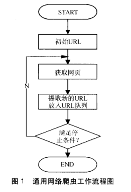

# 通用爬虫和聚焦爬虫

根据使用场景，网络爬虫可分为**通用爬虫**和**聚焦爬虫**两种。
## 通用爬虫

通用网络爬虫 是 捜索引擎抓取系统（Baidu、Google、Yahoo等）的重要组成部分。主要目的是将互联网上的网页下载到本地，形成一个互联网内容的镜像备份
### 通用搜索引擎（Search Engine）工作原理

**通用网络爬虫 **从互联网中搜集网页，采集信息，这些网页信息用于为搜索引擎建立索引从而提供支持，它决定着整个引擎系统的内容是否丰富，信息是否即时，因此其性能的优劣直接影响着搜索引擎的效果。
### 第一步：爬取网页

搜索引擎网络爬虫的基本工作流程如下：
 1. 首先选取一部分的种子URL，将这些URL放入待抓取URL队列；
 2. 取出待抓取URL，解析DNS得到主机的IP，并将URL对应的网页下载下来，存储进已下载网页库中，并且将这些URL放进已抓取URL队列。
 3. 分析已抓取URL队列中的URL，分析其中的其他URL，并且将URL放入待抓取URL队列，从而进入下一个循环....

>搜索引擎如何获取一个新网站的URL：
> 1.  新网站向搜索引擎主动提交网址：（如百度http://zhanzhang.baidu.com/linksubmit/url）
> 2. 在其他网站上设置新网站外链（尽可能处于搜索引擎爬虫爬取范围）
> 3. 搜索引擎和DNS解析服务商(如DNSPod等）合作，新网站域名将被迅速抓取。
* 但是搜索引擎蜘蛛的爬行是被输入了一定的规则的，它需要遵从一些命令或文件的内容，如标注为nofollow的链接，或者是Robots协议。
> Robots协议（也叫爬虫协议、机器人协议等），全称是“网络爬虫排除标准”（Robots Exclusion Protocol），网站通过Robots协议告诉搜索引擎哪些页面可以抓取，哪些页面不能抓取，例如：

>淘宝网：https://www.taobao.com/robots.txt
>腾讯网： http://www.qq.com/robots.txt

